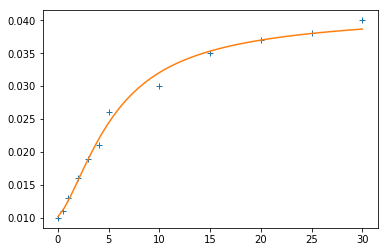
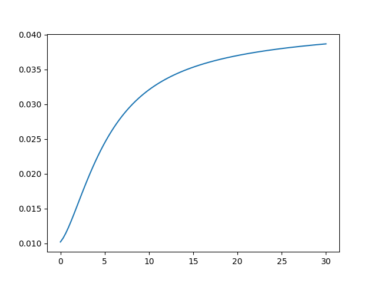

============================
Nelson-Siegel-Svensson Model
============================

.. image:: https://img.shields.io/pypi/v/nelson_siegel_svensson.svg
        :target: https://pypi.python.org/pypi/nelson_siegel_svensson

.. image:: https://img.shields.io/travis/luphord/nelson_siegel_svensson.svg
        :target: https://travis-ci.org/luphord/nelson_siegel_svensson

.. image:: https://readthedocs.org/projects/nelson-siegel-svensson/badge/?version=latest
        :target: https://nelson-siegel-svensson.readthedocs.io/en/latest/?badge=latest
        :alt: Documentation Status

Implementation of the Nelson-Siegel-Svensson interest rate curve model in Python.

.. code-block:: python

        from nelson_siegel_svensson import NelsonSiegelSvenssonCurve
        import numpy as np
        from matplotlib.pyplot import plot

        y = NelsonSiegelSvenssonCurve(0.028, -0.03, -0.04, -0.015, 1.1, 4.0)
        t = np.linspace(0, 20, 100)
        plot(t, y(t))

.. image:: docs/_static/an_example_nelson-siegel-svensson-curve.png

* Free software: MIT license
* Documentation: https://nelson-siegel-svensson.readthedocs.io.

Features
--------

* Python implementation of the Nelson-Siegel curve (three factors)
* Python implementation of the Nelson-Siegel-Svensson curve (four factors)
* Methods for zero and forward rates (as vectorized functions of time points)
* Methods for the factors (as vectorized function of time points)
* Calibration based on ordinary least squares (OLS) for betas and nonlinear optimization for taus
* Simple command line interface (CLI) for evaluating, calibrating and plotting curves

Calibration
-----------

In order to calibrate a curve to given data you can use the `calibrate_ns_ols` and
`calibrate_nss_ols` functions in the `calibrate` module:

.. code-block:: python

        import numpy as np
        from nelson_siegel_svensson.calibrate import calibrate_ns_ols

        t = np.array([0.0, 0.5, 1.0, 2.0, 3.0, 4.0, 5.0, 10.0, 15.0, 20.0, 25.0, 30.0])
        y = np.array([0.01, 0.011, 0.013, 0.016, 0.019, 0.021, 0.026, 0.03, 0.035, 0.037, 0.038, 0.04])

        curve, status = calibrate_ns_ols(t, y, tau0=1.0)  # starting value of 1.0 for the optimization of tau
        assert status.success
        print(curve)

which gives the following output:

.. code-block:: python

        NelsonSiegelCurve(beta0=0.04201739383636799, beta1=-0.031829031569430594, beta2=-0.026797319779108236, tau=1.7170972656534174)

Command Line interface
----------------------

`nelson_siegel_svensson` provides basic functionality using a command line interface (CLI):

.. code-block:: console

        Usage: nelson_siegel_svensson [OPTIONS] COMMAND [ARGS]...

        Commandline interface for nelson_siegel_svensson.

        Options:
        --help  Show this message and exit.

        Commands:
        calibrate  Calibrate a curve to the given data points.
        evaluate   Evaluate a curve at given points.
        plot       Plot a curve at given points.

In order to calibrate a curve to given data points on the command line, try

.. code-block:: console

        nelson_siegel_svensson calibrate -t '[0.0, 0.5, 1.0, 2.0, 3.0, 4.0, 5.0, 10.0, 15.0, 20.0, 25.0, 30.0]' -y '[0.01, 0.011, 0.013, 0.016, 0.019, 0.021, 0.026, 0.03, 0.035, 0.037, 0.038, 0.04]' --nelson-siegel --initial-tau1 1.0

which gives

.. code-block:: console

        {"beta0": 0.042017393764903765, "beta1": -0.03182903146166806, "beta2": -0.026797320316066128, "tau": 1.717097232403383}

This curve can then be evaluated on the command line using

.. code-block:: console

        nelson_siegel_svensson evaluate -c '{"beta0": 0.042017393764903765, "beta1": -0.03182903146166806, "beta2": -0.026797320316066128, "tau": 1.717097232403383}' -t '[0, 1, 2, 3]'

resulting in

.. code-block:: console

        [0.010188362303235707, 0.012547870204470839, 0.01574855552855885, 0.01897955804146046]

And finally, the curve can be plotted with

.. code-block:: console

        nelson_siegel_svensson plot -o cli_plot_example.png -c '{"beta0": 0.042017393764903765, "beta1": -0.03182903146166806, "beta2": -0.026797320316066128, "tau": 1.717097232403383}'

Note that the quoting in the above commands prevents `bash` from evalutating the JSON-based parameters. Depending on your shell, you may require a different quoting mechanism.

Credits
-------

Main developer is luphord_.

.. _luphord: https://github.com/luphord

This package was prepared with Cookiecutter_ and the `audreyr/cookiecutter-pypackage`_ project template.

.. _Cookiecutter: https://github.com/audreyr/cookiecutter
.. _`audreyr/cookiecutter-pypackage`: https://github.com/audreyr/cookiecutter-pypackage
