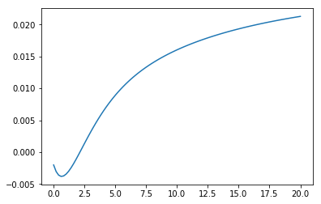

=====
Usage
=====

To instantiate and evaluate a Nelson-Siegel-Svensson-Curve simply import
the curve class, call the constructor with the desired parameters
and then call the resulting curve instance with a numpy array of time points:

.. code-block:: python

        from nelson_siegel_svensson import NelsonSiegelSvenssonCurve
        import numpy as np
        from matplotlib.pyplot import plot

        y = NelsonSiegelSvenssonCurve(0.028, -0.03, -0.04, -0.015, 1.1, 4.0)
        t = np.linspace(0, 20, 100)
        plot(t, y(t))

